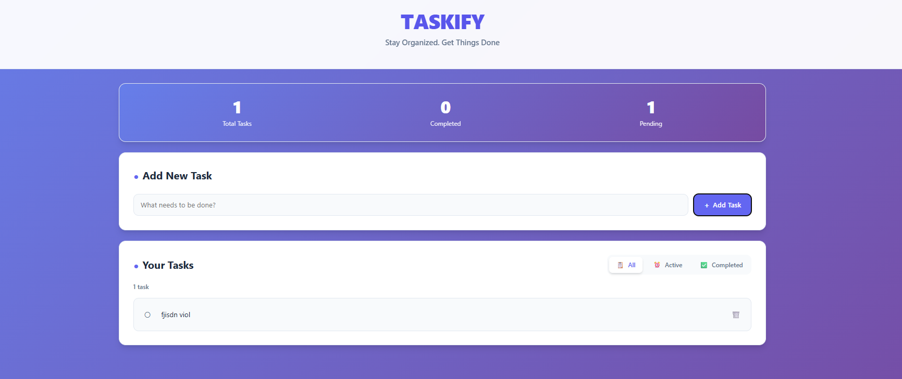
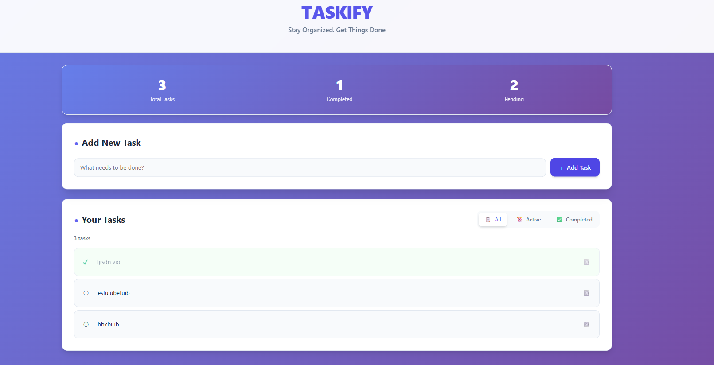

# Taskify - Project Management System

A full-stack project management application built with .NET 8 backend and React + TypeScript frontend, featuring task management, project organization, and smart scheduling capabilities.

### Basic Task Manager
- [x] Display list of tasks
- [x] Add new tasks with description
- [x] Mark tasks as completed/uncompleted
- [x] Delete tasks
- [x] Task filtering (All/Completed/Active)
- [x] Beautiful Bootstrap/Tailwind-inspired UI
- [x] RESTful API with .NET 8
- [x] React + TypeScript frontend

## 🛠️ Tech Stack

### Backend
- **Framework**: .NET 8 Web API
- **Database**: Entity Framework Core with In-Memory Database
- **Documentation**: Swagger/OpenAPI

### Frontend
- **Framework**: React 18 with TypeScript
- **Routing**: React Router DOM
- **HTTP Client**: Axios
- **Styling**: Custom CSS with Bootstrap-inspired design

### Prerequisites
- .NET 8 SDK
- Node.js 16+ and npm
- Git

### Backend Setup
cd backend/TaskManager.API
dotnet restore
dotnet run

### Frontend Setup
cd frontend
npm install
npm start

